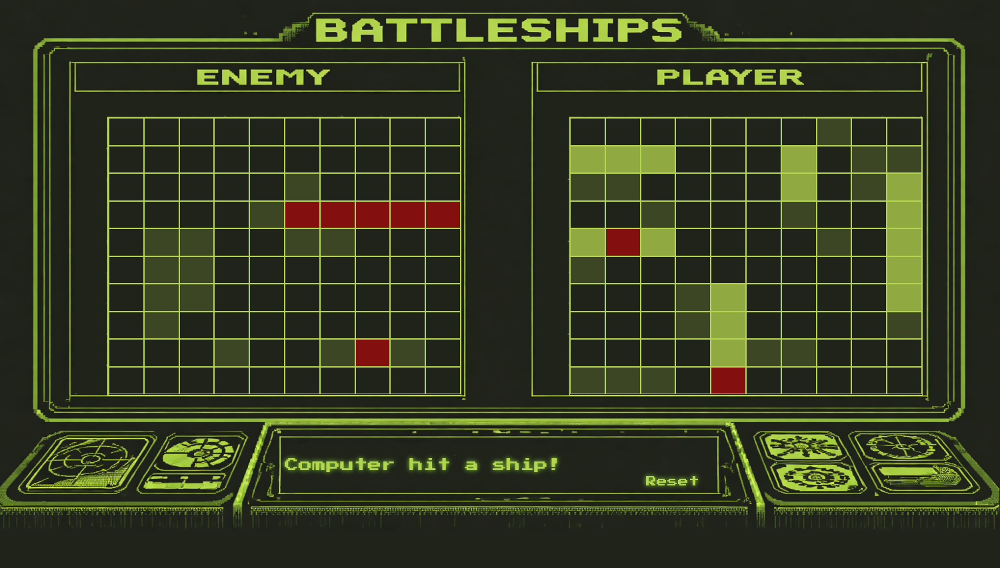

  

<h3 align="center">BattleShips</h3>

   

---

## 📝 Table of Contents
- [About](#about)
- [Deployment](#deployment)
- [Built Using](#built_using)
- [Acknowledgments](#acknowledgement)

## 🧐 About 
This started as just a basic project , but soon I wanted to give this a feel of a retro style battleship game. The game is a basic battleship game. User picks a location and the computer follows up with a location of thier own. the game is logged complete on a board in the backend as well as in the UI. The backgound was generated us AI but the board that the game is actually played on and all code is 100% hand coded.

## 🚀 Deployment 
Super easy to give the game a try just [Click Here](https://wlewis0991.github.io/Battleships/).

## ⛏️ Built Using 

## 🎉 Acknowledgements 
Huge thanks the The Odin Project for helping me learn everything along the way to produce something like this.